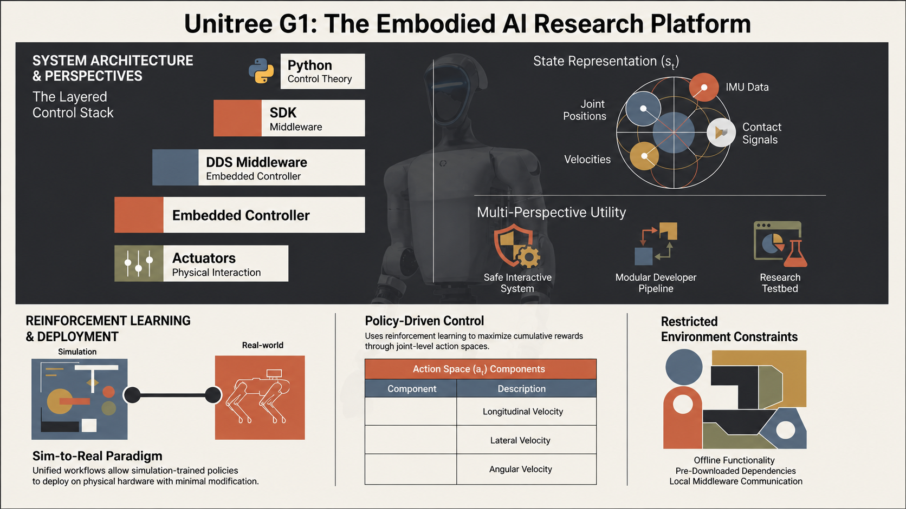

# Research, Academic and Development Tutorial
### June 2026



## Featured Demo

[](https://profespinosaaiml.github.io/UnitreeG1Hub/videos/g1_fingers_arms_sdk_dds_demo4.mp4)

[Play the finger and arm motion demo](https://profespinosaaiml.github.io/UnitreeG1Hub/videos/g1_fingers_arms_sdk_dds_demo4.mp4)

## Abstract
This repository presents a research-oriented tutorial on the Unitree G1 humanoid robot, designed to bridge the gap between user-level interaction, developer-level system integration, and researcher-level experimentation. The tutorial frames the G1 as a complete embodied AI platform, where control, middleware, and learning systems converge to enable advanced humanoid behaviors.

The goal is to provide a structured pathway from first interaction with the robot to the development of reproducible, simulation-to-real (sim-to-real) reinforcement learning pipelines. Particular emphasis is placed on real-world constraints such as offline operation, middleware dependencies, and hardware safety considerations, which fundamentally shape how modern robotics systems are deployed and studied.

This work draws from documented setup procedures, control architectures, and experimental logs to present a unified perspective on humanoid robotics workflows fileciteturn1file0 fileciteturn1file1.

---

## Background

Humanoid robotics represents one of the most challenging domains in robotics due to:
- High-dimensional control spaces
- Complex contact dynamics
- Tight real-time constraints
- Integration of perception, control, and learning

The Unitree G1 platform provides a modern architecture that exposes these challenges while remaining accessible through a layered software stack. At a high level, the system can be understood as:

Python → SDK → DDS Middleware → Embedded Controller → Actuators

This abstraction enables users to interact with the robot at multiple levels, ranging from safe high-level commands to low-level control interfaces suitable for advanced research.

---

## Purpose of This Tutorial

The primary purpose of this repository is to:

1. Provide a clear conceptual and practical understanding of the G1 humanoid system  
2. Demonstrate how to operate within real-world robotics constraints (e.g., offline environments)  
3. Present a unified sim-to-real workflow for control and learning  
4. Introduce reinforcement learning as a central methodology for humanoid control  

Rather than focusing on isolated scripts or examples, this tutorial emphasizes **system-level reasoning**, where each component—control logic, middleware, simulation, and hardware—plays a defined role in the overall architecture.

---

🚀 Get Started: Your First G1 Sim-to-Real Experience

Kick things off with a hands-on tutorial that takes you from simulation to reality—seamlessly.

✨ In this first tutorial, you’ll:

🧠 Write Python control code in Isaac Lab / Isaac Sim    
🔄 See how that exact logic maps directly to the real robot     
🤖 Deploy and execute it on the physical Unitree G1 

Find the notebooks and the code in:

```
./notebooks/LeftHandRaise7DF_PrototypeOne/LeftHandRaise7DF_TutorialOne.ipynb
./notebooks/LeftHandRaise7DF_PrototypeOne/LeftHandRaise7DF_TutorialTwo.ipynb
./src/LeftHandRaise7DF_PrototypeOne/*.py
```

💡 This is your entry point into understanding how modern humanoid robotics systems are built, tested, and deployed.

👉 Download the repo and try it yourself—there’s nothing like seeing your code come to life on a real humanoid robot.

---

⚠️ Prerequisites

Before running this tutorial, ensure you have:

🧩 A working installation of Isaac Sim    
🔬 A configured Isaac Lab environment    

📘 Installation guidelines are provided here:    
👉 ./notebooks/IsaacSimInstall     
👉 ./src/IsaacSimInstall     

---

## Multi-Perspective Approach

### User Perspective
From the user standpoint, the G1 is an interactive system:
- High-level commands provide safe and intuitive control
- Built-in abstractions reduce the risk of hardware damage
- The system is suitable for teaching, demonstrations, and rapid prototyping

### Developer Perspective
From the developer standpoint, the system exposes:
- Middleware-driven communication (DDS)
- Modular control pipelines
- Integration points for simulation and hardware execution

Developers must understand how software components map onto hardware behavior, particularly in environments where standard infrastructure (e.g., internet access) is unavailable.

### Researcher Perspective
From the research standpoint, the G1 becomes:
- A platform for studying locomotion, manipulation, and control
- A testbed for sim-to-real transfer
- A system for evaluating reinforcement learning algorithms in embodied settings

This perspective requires formal modeling, reproducibility, and careful consideration of system dynamics.

---

## System Modeling and State Representation

The robot state can be represented as:

$$
s_t = [q, \dot{q}, \text{IMU}, \text{contacts}]
$$

where:
- $q$ represents joint positions  
- $\dot{q}$ represents joint velocities  
- IMU provides orientation and acceleration data  
- contact signals encode interaction with the environment  

This state forms the foundation for both classical control and learning-based approaches.

---

## Reinforcement Learning Framework

Reinforcement learning (RL) plays a central role in modern humanoid robotics, enabling policies to be learned rather than manually engineered.

### Policy Formulation

$$
a_t \sim \pi_\theta(a_t \mid s_t)
$$

where:
- $s_t$ is the state
- $a_t$ is the action
- $\pi_\theta$ is a parameterized policy

### Objective Function

$$
J(\theta) = \mathbb{E}_{\pi_\theta} \left[ \sum_{t=0}^{T} \gamma^t r(s_t, a_t) \right]
$$

The objective is to maximize expected cumulative reward over time.

### Action Space

$$
a_t = [v_x, v_y, \omega]
$$

These high-level commands are mapped to joint-level control through intermediate representations.

---

## Sim-to-Real Paradigm

A defining feature of this tutorial is the emphasis on sim-to-real transfer.

The same control logic is designed to operate across:
- Simulation environments (e.g., physics-based articulation models)
- Physical hardware (via DDS communication)

This alignment ensures that policies developed in simulation can be deployed on the real robot with minimal modification, provided that:
- Dynamics are sufficiently modeled
- Control interfaces are consistent
- Noise and delays are accounted for

---

## Real-World Constraints

A critical insight emphasized throughout this tutorial is that real robots often operate in **restricted environments**.

Observed constraints include:
- Lack of internet connectivity
- Dependency on pre-downloaded packages
- Requirement for offline installation workflows

These constraints are not incidental—they fundamentally shape system design, reproducibility, and deployment strategies.

---

## Research Goals

This repository supports the following research directions:

- Development of stable locomotion policies  
- Exploration of whole-body control strategies  
- Integration of perception with control  
- Study of sim-to-real transfer efficiency  
- Benchmarking of reinforcement learning algorithms  

By combining structured tutorials with real system constraints, the project aims to provide a realistic foundation for advanced humanoid robotics research.

---

## Conclusion

The Unitree G1 humanoid robot represents a convergence of robotics, control theory, and machine learning. This tutorial positions the system as both an educational tool and a research platform, emphasizing:

- Layered system architecture  
- Middleware-driven communication  
- Sim-to-real consistency  
- Reinforcement learning as a core methodology  

The result is a comprehensive framework for understanding and advancing humanoid robotics in real-world settings.

---

## References

- Unitree SDK and tutorial artifacts: https://support.unitree.com/home/en/G1_developer/about_G1  
- System setup and middleware workflow: https://github.com/unitreerobotics/unitree_sdk2_python/tree/master/example/g1  
